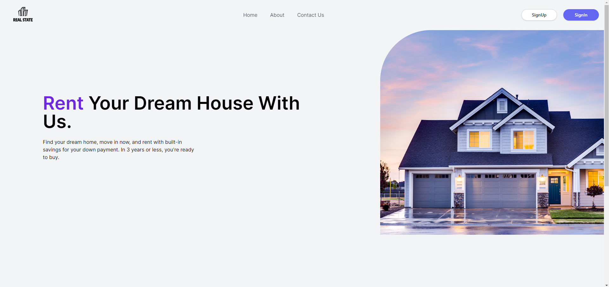
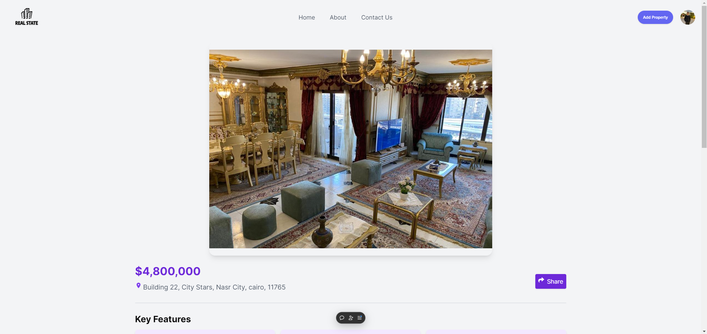
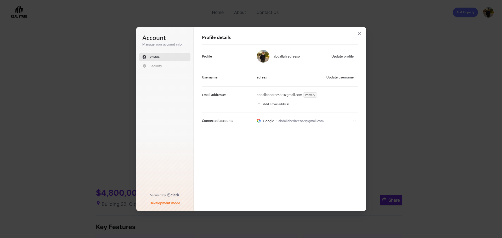

# React + Vite - Real Estate Management

## Table of contents

- [Overview](#overview)
  - [Team members](#team-members)
  - [Screenshot](#screenshot)
  - [Links](#links)
- [My process](#my-process)
  - [Built with](#built-with)
- [Author](#author)

## Overview

### Team members

- Abdallah Edrees [Team-leader]
- Shahd AlSayed
- Emad Mostafa
- Yousef Halawa
- Rana Amr

### Screenshot

### Links

- Code URL: (https://github.com/abdallahedreeso/real-estate-management)

- Deployment (Vercle) URL: (https://real-estate-management-i49w9htnx-abdallahedreesos-projects.vercel.app/)

- Presentation URL: (https://docs.google.com/presentation/d/18HFNo-JX4dboGwW9HEB05ByOMCMeOB_D/edit?usp=sharing&ouid=101104021309986710436&rtpof=true&sd=true)

- Proposal URL: (https://docs.google.com/document/d/1vuSesYbvglFRYP84SxC5njGoCeFObM9x/edit?usp=sharing&ouid=101104021309986710436&rtpof=true&sd=true)

## My process

### Built with

- React.js - Vite
- Supabase
- AntDesign & Tailwind
- Clerk

## Author

- Component Crafterz
